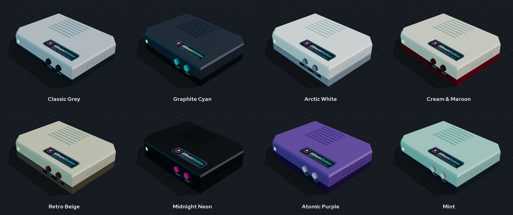

# ABleemStation - a retro-console case for the Raspberry Pi 3B / 3B+

A 3D-printable case that turns a Raspberry Pi 3 running AutoBleem into a small console under the TV:
140 x 105 x 27.6 mm (just tall enough for the Pi's USB stack), cut corners in the ab2.0.0 style, hidden cooling
vents in the roof and the side (no line of sight into the case), working POWER / RESET buttons, a front LED behind
a clear lens (a plain LED or an RGB pixel that shows green / orange like the PlayStation Classic), and stickers.
Open `files/ableemstation-viewer.html` in a browser for the 3D model (orbit, explode, show the Pi, X-ray, colourways).



## Files (`files/`)

| File | What |
|---|---|
| `ableemstation-{shell,shell-rgb,base,button,lens}.step` | the parts for CAD (Fusion, FreeCAD, SolidWorks); `ableemstation-assembly.step` = everything in place |
| `ableemstation-{shell,shell-rgb,base,button,lens}.stl` | the parts for the slicer (`shell` = plain LED, `shell-rgb` = RGB pixel) |
| `ableemstation-{shell,shell-rgb,base,button,lens}.3mf` | the same, already turned the way they print (shell roof-down, button and lens flange-down) |
| `ableemstation-all-parts.3mf`, `-all-parts-rgb.3mf` | everything to print in one file, per LED version: shell, base, 2 buttons, the lens |
| `ableemstation-viewer.html` | the 3D viewer (three.js from a CDN, so it needs internet) |
| `renders/` | 3/4, front, back, side, exploded with the Pi, X-ray; `colors/` + `colorways.png` = the colour options |
| `stickers/ableemstation-stickers-A4.pdf` | the sticker sheet, 1:1, two sets, cut lines; `stickers/*.svg` / `*.png` = each sticker |
| `stickers/cricut-144dpi/` | one transparent PNG per sticker at 144 dpi, for a Cricut's Print Then Cut |
| `orca/` | Orca Slicer process profiles: "ABleemStation - ASA" (quality) and "ABleemStation - ASA Prototype" (fast fit test) |

Layout: back = power, HDMI, audio (the TV cables). Seen from the front, the USB + Ethernet are on the left side,
the LED is front-left, and POWER / RESET are front-right. The microSD can be reached through a slot in the floor.

## Building the files (`src/`)

Every size is a variable at the top of `make_case.py`, and every file in `files/` is generated - change the
script, never a file. Needs Python 3, `pip install build123d`, and Chrome for the renders, the PDF and the
sticker PNGs (`CHROME=<path>` if it is not found).

```
cd src
python make_case.py          # parts: STEP, STL, 3MF; the fit check (the Pi must overlap the case by 0 mm3)
python make_stickers.py      # stickers: SVG, PNG, the A4 PDF, the Cricut PNGs
python make_viewer.py        # the viewer + the renders (after the two above)
python make_orca_profile.py  # the Orca profiles to files/orca/ (--install also copies them into Orca's user folder)
```

`src/fonts/` holds Open Sans and Red Hat Text (SIL Open Font License, the licences are next to the fonts).

## Printing (ASA or PLA, no supports)

- **shell**: upside down (roof on the bed). Two colours: a filament change at the layer that starts the dark band -
  **16.68 mm** with 0.16 mm layers, **16.80 mm** with 0.24 mm layers (`make_case.py` prints both). Everything above it is the lower band.
- **base**: flat, standoffs up. **button** x 2: standing on the flange.
- **lens**: clear PETG, standing on the flange, 100 % infill and slow, so it stays as clear as it can.
- ASA: a closed, warm chamber; let the parts cool on the bed.

The Orca profiles target a Voron Trident 300 (0.4 nozzle, Klipper) set up on Orca's "MyKlipper 0.4 nozzle" printer;
use them with a calibrated ASA filament profile (temperatures, flow ratio and shrink come from the filament).
- **ABleemStation - ASA**: 0.16 mm layers, 5 walls (the 2.4 mm walls are solid perimeters), Arachne, outer wall /
  top 60 mm/s at 3000 mm/s², seam at the back, precise outer wall, hole compensation 0.1 mm, elephant foot 0.15 mm,
  mouse-ear brim, gyroid 25 %.
- **ABleemStation - ASA Prototype**: the same fit settings with 0.24 mm layers, 3 walls, 12 % grid and walls at
  150 / 220 mm/s - a fast print that still answers "does it fit".

In Orca, the colour change goes on the layer slider in the preview ("+" -> Change filament for a second spool in a
multi-material unit, or Add pause for a manual swap; `M600` only if the printer has that macro).

## Hidden vents and the LED

- **Roof**: each slot you see is 1 mm deep; under it a 0.8 mm channel leads sideways to the inner slot, half a
  pitch over. Air passes, the eye does not - looking in, you see the channel's floor. The roof is 3.2 mm for it;
  printed roof-down, the channel's ceiling bridges only ~3.5 mm.
- **Side** (opposite the USB): slots through the wall with a baffle 1.8 mm behind them, closed at both ends and
  open below, so the air turns down under it and the inside stays out of sight.
- **LED**: the clear lens is pushed into the front hole from inside (its flange sits in a counterbore), and the
  LED stays hidden behind it:
  - `shell`: a plain 5 mm LED in the holder tube, its tip 0.3 mm behind the lens;
  - `shell-rgb`: one **WS2812B** pixel cut from an LED strip (10 mm wide), slid into the slot behind the lens from
    below, the LED facing the lens, the three wires out at the bottom. It keeps its last colour while it has 5 V -
    so a small service on the Pi sets green at boot and orange at shutdown, and the orange stays on through the
    standby, as on the PlayStation Classic.

## Parts

| Qty | Part |
|---|---|
| 4 | M3 heat-set insert, short (4 mm hole, 5-6 mm long), pressed into the shell's bosses |
| 4 | M3 x 8 countersunk screw (base -> inserts) |
| 4 | M2.5 x 5 screw (Pi -> standoffs, self-tapping) |
| 2 | 6 x 6 mm tact switch, 5 mm tall, into the bracket's pockets, legs bent back |
| 1 | 5 mm LED + 330 Ω resistor, into the front holder |
| 4 | rubber feet Ø 12 mm |

## Wiring (BCM numbers, physical pins in brackets)

- **POWER**: GPIO3 (pin 5) to GND (pin 6); `dtoverlay=gpio-shutdown` in `config.txt` - press to shut down, press
  again to wake the Pi from halt.
- **RESET**: across the Pi 3's **RUN** pads (solder a 2-pin header).
- **LED**: GPIO14 / TXD (pin 8) -> 330 Ω -> LED -> GND (pin 9); with `enable_uart=1` it is lit while the Pi runs.

## Stickers

- Inkjet / laser on vinyl: print `stickers/ableemstation-stickers-A4.pdf` at 100 % (no "fit to page"); the top plate
  must measure 61 mm. The roof and the front have 0.4 mm recesses the stickers sit in.
- Cricut (Print Then Cut): upload the PNGs from `stickers/cricut-144dpi/`. If Design Space shows a different size,
  set it by hand: top 61 x 17 mm, front 43 x 4.6 mm, side 80 x 8 mm, bottom 54 x 30 mm.
