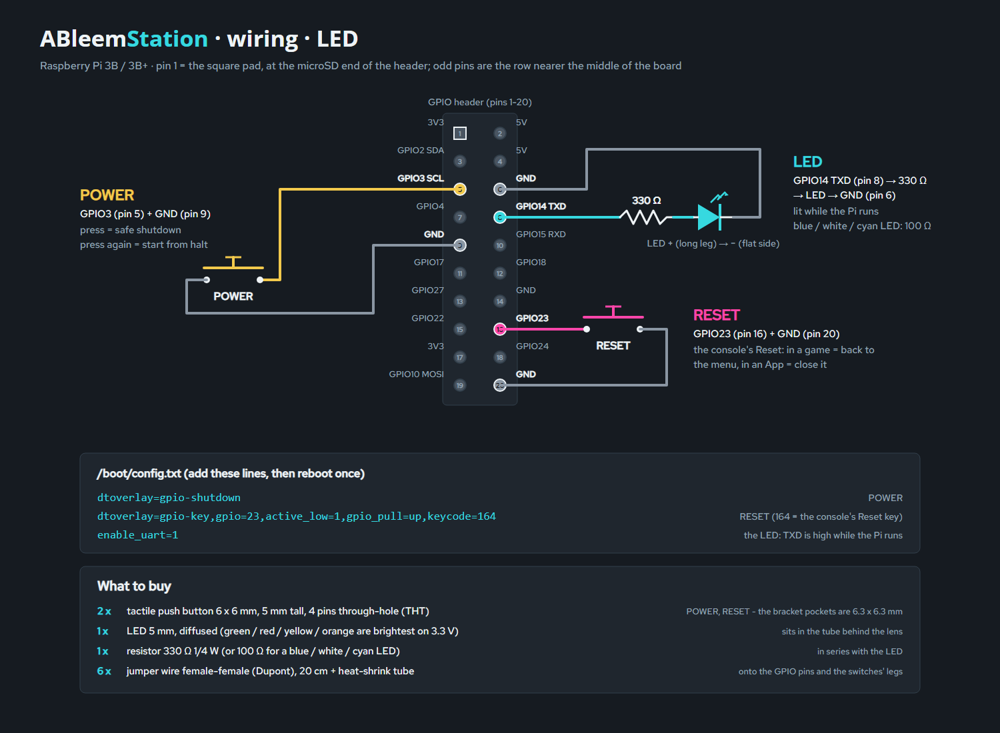
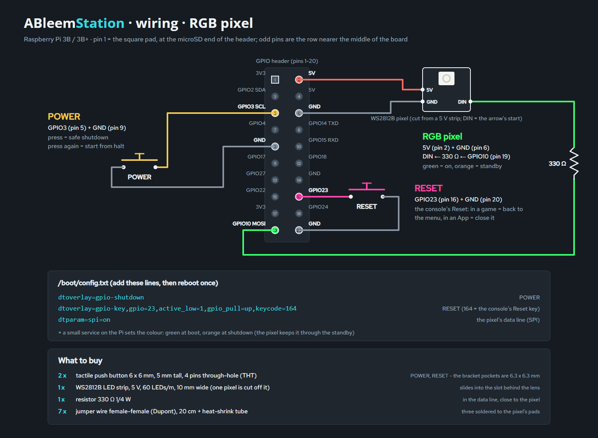

# ABleemStation - a retro-console case for the Raspberry Pi 3B / 3B+

A 3D-printable case that turns a Raspberry Pi 3 running AutoBleem into a small console under the TV:
140 x 105 x 26.8 mm (just tall enough for the Pi's USB stack), cut corners in the ab2.0.0 style, cooling slots in
the roof and the side, working POWER / RESET buttons and a front LED, and ABleemStation stickers.
Open `files/ableemstation-viewer.html` in a browser for the 3D model (orbit, explode, show the Pi, X-ray, colourways).


## Files (`files/`)

| File | What |
|---|---|
| `ableemstation-{shell,base,button}.step` | the parts for CAD (Fusion, FreeCAD, SolidWorks); `ableemstation-assembly.step` = everything in place |
| `ableemstation-{shell,base,button}.stl` | the parts for the slicer |
| `ableemstation-{shell,base,button}.3mf` | the same, already turned the way they print (shell roof-down, button flange-down) |
| `ableemstation-all-parts.3mf` | everything to print in one file: shell, base, 2 buttons (the slicer's auto-arrange spreads them) |
| `ableemstation-viewer.html` | the 3D viewer (three.js from a CDN, so it needs internet) |
| `renders/` | 3/4, front, back, side, exploded with the Pi, X-ray; `colors/` + `colorways.png` = the colour options |
| `stickers/ableemstation-stickers-A4.pdf` | the sticker sheet, 1:1, two sets, cut lines; `stickers/*.svg` / `*.png` = each sticker |
| `stickers/cricut-144dpi/` | one transparent PNG per sticker at 144 dpi, for a Cricut's Print Then Cut |
| `wiring.svg`, `wiring.png` | the wiring diagram + what to buy, plain LED (`src/make_wiring.py`) |
| `wiring-rgb.svg`, `wiring-rgb.png` | the same with a WS2812B RGB pixel instead of the LED |
| `orca/` | Orca Slicer process profiles: "ABleemStation - ASA" (quality) and "ABleemStation - ASA Prototype" (fast fit test) |

Layout: back = power, HDMI, audio (the TV cables). Seen from the front, the USB + Ethernet are on the left side,
the LED is front-left, and POWER / RESET are front-right. The microSD can be reached through a slot in the floor.

## Building the files (`src/`)

Every size is a variable at the top of `make_case.py`, and every file in `files/` is generated - change the
script, never a file. Needs Python 3, `pip install build123d`, and Chrome for the renders, the PDF and the
sticker PNGs (`CHROME=<path>` if it is not found).

```
cd src
python make_case.py          # parts: STEP, STL, 3MF; the fit check (the Pi must overlap the case by 0 mm3)
python make_stickers.py      # stickers: SVG, PNG, the A4 PDF, the Cricut PNGs
python make_viewer.py        # the viewer + the renders (after the two above)
python make_wiring.py        # the wiring diagram
python make_orca_profile.py  # the Orca profiles to files/orca/ (--install also copies them into Orca's user folder)
```

`src/fonts/` holds Open Sans and Red Hat Text (SIL Open Font License, the licences are next to the fonts).

## Printing (ASA or PLA, no supports)

- **shell**: upside down (roof on the bed). Two colours: a filament change at the layer that starts the dark band -
  **15.88 mm** with 0.16 mm layers, **15.80 mm** with 0.24 mm layers. Everything above it is the lower band.
- **base**: flat, standoffs up. **button** x 2: standing on the flange.
- ASA: a closed, warm chamber; let the parts cool on the bed.

The Orca profiles target a Voron Trident 300 (0.4 nozzle, Klipper) set up on Orca's "MyKlipper 0.4 nozzle" printer;
use them with a calibrated ASA filament profile (temperatures, flow ratio and shrink come from the filament).
- **ABleemStation - ASA**: 0.16 mm layers, 5 walls (the 2.4 mm walls are solid perimeters), Arachne, outer wall /
  top 60 mm/s at 3000 mm/s², seam at the back, precise outer wall, hole compensation 0.1 mm, elephant foot 0.15 mm,
  mouse-ear brim, gyroid 25 %.
- **ABleemStation - ASA Prototype**: the same fit settings with 0.24 mm layers, 3 walls, 12 % grid and walls at
  150 / 220 mm/s - a fast print that still answers "does it fit".

In Orca, the colour change goes on the layer slider in the preview ("+" -> Change filament for a second spool in a
multi-material unit, or Add pause for a manual swap; `M600` only if the printer has that macro).

## Parts

| Qty | Part |
|---|---|
| 4 | M3 heat-set insert, short (4 mm hole, 5-6 mm long), pressed into the shell's bosses |
| 4 | M3 x 8 countersunk screw (base -> inserts) |
| 4 | M2.5 x 5 screw (Pi -> standoffs, self-tapping) |
| 2 | 6 x 6 mm tactile switch, 5 mm tall, 4 pins through-hole, into the bracket's pockets, legs bent back |
| 1 | the front light, either: a 5 mm diffused LED + 330 Ω 1/4 W resistor (100 Ω for blue / white / cyan), or one WS2812B pixel cut from a 5 V, 10 mm strip + 330 Ω resistor |
| 6-7 | jumper wire female-female (Dupont), 20 cm, + heat-shrink tube |
| 4 | rubber feet Ø 12 mm |

## Wiring (BCM numbers, physical pins in brackets)

Two versions of the front light, the same buttons:





- **POWER**: GPIO3 (pin 5) to GND (pin 9); `dtoverlay=gpio-shutdown` in `config.txt` - press to shut down, press
  again to wake the Pi from halt.
- **RESET**: GPIO23 (pin 16) to GND (pin 20);
  `dtoverlay=gpio-key,gpio=23,active_low=1,gpio_pull=up,keycode=164` in `config.txt`. Keycode 164 is the key the
  PlayStation Classic's Reset button sends, so AutoBleem treats it the same way: in a game it goes back to the menu,
  in an App it closes the App. It is a software reset, not a power cycle.
- **LED** (plain version): GPIO14 / TXD (pin 8) -> 330 Ω -> LED -> GND (pin 6); with `enable_uart=1` it is lit while
  the Pi runs. Green / red / yellow / orange LEDs are the brightest on 3.3 V; a blue / white / cyan one wants 100 Ω.
- **RGB pixel** (RGB version): 5V (pin 2), GND (pin 6), DIN <- 330 Ω <- GPIO10 / SPI MOSI (pin 19), with
  `dtparam=spi=on`. A small service on the Pi sets the colour - green while it runs, orange at shutdown; the pixel
  keeps its last colour as long as it has 5 V, so the standby stays orange like on the console.

## Stickers

- Inkjet / laser on vinyl: print `stickers/ableemstation-stickers-A4.pdf` at 100 % (no "fit to page"); the top plate
  must measure 61 mm. The roof and the front have 0.4 mm recesses the stickers sit in.
- Cricut (Print Then Cut): upload the PNGs from `stickers/cricut-144dpi/`. If Design Space shows a different size,
  set it by hand: top 61 x 17 mm, front 43 x 4.6 mm, side 80 x 8 mm, bottom 54 x 30 mm.
