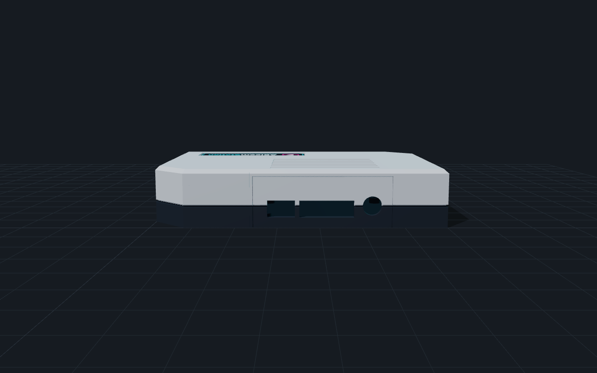

# ABleemStation - a retro-console case for the Raspberry Pi

A 3D-printable case that turns a Raspberry Pi 3 running AutoBleem into a small console under the TV:
140 x 105 x 27.6 mm (just tall enough for the Pi's USB stack), cut corners in the ab2.0.0 style, hidden cooling
vents in the roof and the side (no line of sight into the case), working POWER / RESET buttons, a front LED behind
a clear lens (a plain LED or an RGB pixel that shows green / orange like the PlayStation Classic), and stickers.
Open `files/ableemstation-viewer.html` in a browser for the 3D model (orbit, explode, show the Pi, X-ray, colourways).

Two versions: the **Pi 3** case (below) for a Raspberry Pi 3B / 3B+, and the **universal** case for the Pi 2B, 3B,
3B+, 4B and 5, whose port walls are separate panels printed per board ([Universal case](#universal-case-pi-2--3--4--5)).


## Files (`files/`)

| File | What |
|---|---|
| `ableemstation-{shell,shell-rgb,base,button,lens}.step` | the parts for CAD (Fusion, FreeCAD, SolidWorks); `ableemstation-assembly.step` = everything in place |
| `ableemstation-{shell,shell-rgb,base,button,lens}.stl` | the parts for the slicer (`shell` = plain LED, `shell-rgb` = RGB pixel) |
| `ableemstation-{shell,shell-rgb,base,button,lens}.3mf` | the same, already turned the way they print (shell roof-down, button and lens flange-down) |
| `ableemstation-all-parts.3mf`, `-all-parts-rgb.3mf` | everything to print in one file, per LED version: shell, base, 2 buttons, the lens |
| `ableemstation-viewer.html` | the 3D viewer (three.js from a CDN, so it needs internet) |
| `renders/` | 3/4, front, back, side, exploded with the Pi, X-ray; `colors/` + `colorways.png` = the colour options |
| `stickers/ableemstation-stickers-A4.pdf` | the sticker sheet, 1:1, two sets, cut lines; `stickers/*.svg` / `*.png` = each sticker |
| `stickers/cricut-144dpi/` | one transparent PNG per sticker at 144 dpi, for a Cricut's Print Then Cut |
| `wiring.svg`, `wiring.png` | the wiring diagram + what to buy, plain LED (`src/make_wiring.py`) |
| `wiring-rgb.svg`, `wiring-rgb.png` | the same with a WS2812B RGB pixel instead of the LED |
| `universal/` | the universal case: shells, panels, viewer, renders ([Universal case](#universal-case-pi-2--3--4--5)) |
| `orca/` | Orca Slicer process profiles: "ABleemStation - ASA" (quality), "ABleemStation - ASA Base" (the base, 0.20 mm) and "ABleemStation - ASA Prototype" (fast fit test) |

Layout: back = power, HDMI, audio (the TV cables). Seen from the front, the USB + Ethernet are on the left side,
the LED is front-left, and POWER / RESET are front-right. The microSD can be reached through a slot in the floor.

## Building the files (`src/`)

Every size is a variable at the top of `make_case.py`, and every file in `files/` is generated - change the
script, never a file. Needs Python 3, `pip install build123d`, and Chrome for the renders, the PDF and the
sticker PNGs (`CHROME=<path>` if it is not found).

```
cd src
python make_case.py          # parts: STEP, STL, 3MF; the fit check (the Pi must overlap the case by 0 mm3)
python make_universal.py     # the universal case: shells + panels to files/universal/, fit checks per board
python make_stickers.py      # stickers: SVG, PNG, the A4 PDF, the Cricut PNGs
python make_viewer.py        # the viewer + the renders (after the two above)
python make_viewer.py universal   # the universal case's viewer + renders
python make_wiring.py        # the wiring diagram
python make_orca_profile.py  # the Orca profiles to files/orca/ (--install also copies them into Orca's user folder)
```

`src/fonts/` holds Open Sans and Red Hat Text (SIL Open Font License, the licences are next to the fonts).

## Printing (ASA or PLA, no supports)

- **shell**: upside down (roof on the bed). Two colours: a filament change at the layer that starts the dark band -
  **16.68 mm** with 0.16 mm layers, **16.80 mm** with 0.24 mm layers (`make_case.py` prints both). Everything above it is the lower band.
- **base**: flat, standoffs up - with "ABleemStation - ASA Base" (0.20 mm: nobody sees it). **button** x 2: standing
  on the flange.
- **lens**: clear PETG, standing on the flange, 100 % infill and slow, so it stays as clear as it can.
- ASA: a closed, warm chamber; let the parts cool on the bed.

The Orca profiles target a Voron Trident 300 (0.4 nozzle, Klipper) set up on Orca's "MyKlipper 0.4 nozzle" printer;
use them with a calibrated ASA filament profile (temperatures, flow ratio and shrink come from the filament).
- **ABleemStation - ASA**: 0.16 mm layers, 5 walls (the 2.4 mm walls are solid perimeters), Arachne, outer wall /
  top 60 mm/s at 3000 mm/s², seam at the back, precise outer wall, hole compensation 0.1 mm, elephant foot 0.15 mm,
  mouse-ear brim, gyroid 25 %.
- **ABleemStation - ASA Base**: the final base (or `uni-base`) - hidden under the case, so 0.20 mm layers, 4 walls,
  20 % gyroid, walls at 120 / 180 mm/s; the fit settings (hole and elephant-foot compensation) stay, since the base
  sits inside the shell and carries the standoffs and the countersunk screws.
- **ABleemStation - ASA Prototype**: the same fit settings with 0.24 mm layers, 3 walls, 12 % grid and walls at
  150 / 220 mm/s - a fast print that still answers "does it fit".

In Orca, the colour change goes on the layer slider in the preview ("+" -> Change filament for a second spool in a
multi-material unit, or Add pause for a manual swap; `M600` only if the printer has that macro).

## Hidden vents and the LED

- **Roof**: each slot you see is 1 mm deep; under it a 0.8 mm channel leads sideways to the inner slot, half a
  pitch over. Air passes, the eye does not - looking in, you see the channel's floor. The roof is 3.2 mm for it;
  printed roof-down, the channel's ceiling bridges only ~3.5 mm.
- **Side** (opposite the USB): slots through the wall with a baffle 1.8 mm behind them, closed at both ends and
  open below, so the air turns down under it and the inside stays out of sight.
- **LED**: the clear lens is pushed into the front hole from inside (its flange sits in a counterbore), and the
  LED stays hidden behind it:
  - `shell`: a plain 5 mm LED in the holder tube, its tip 0.3 mm behind the lens;
  - `shell-rgb`: one **WS2812B** pixel cut from an LED strip (10 mm wide), slid into the slot behind the lens from
    below, the LED facing the lens, the three wires out at the bottom. It keeps its last colour while it has 5 V -
    so a small service on the Pi sets green at boot and orange at shutdown, and the orange stays on through the
    standby, as on the PlayStation Classic.

## Universal case (Pi 2 / 3 / 4 / 5)

The boards share the 85 x 56 mm outline, the mounting holes and the GPIO header, so the base, the buttons, the lens
and most of the shell are the Pi 3 case's. What differs are the ports on two edges - and the front can take USB:

| Opening | Panels (`files/universal/ableemstation-panel-*`) |
|---|---|
| back (power, HDMI, audio) | `back-pi23` (micro-USB, HDMI, audio) · `back-pi4` (USB-C, 2 x micro-HDMI, audio) · `back-pi5` (USB-C, 2 x micro-HDMI) · `back-blank` |
| side (USB, Ethernet) | `right-pi23` · `right-pi4` (Ethernet and USB swapped) · `right-pi5` · each also `-front` (one USB block closed, see below) · `right-blank` (to drill yourself) |
| front (between the buttons and the LED) | `front-blank` · `front-usb` (two USB-A sockets) |

- **Assembly - everything on the base**: `uni-base` is the Pi 3 case's base plus a rebate along each opening and
  the front USB pedestal. Screw the Pi down, fit the switches and the USB sockets, and stand the panels in the
  rebates (a tab on each panel's inside sits in it). Then slide the shell down over it all: each panel's tongue (its
  inner half) runs up the grooves in the opening's sides and ends in a groove in the roof. Four screws from below,
  done. Swapping a board = lifting the shell and swapping two panels.
- **Shells**: `uni-shell` (the hidden roof vents of the Pi 3 case) and `uni-shell-active` (a longer, 8-slot field over
  the Raspberry Pi 5 **Active Cooler**, 63.5 x 42.5 x 13.7 mm - it fits under the roof with 3 mm to spare), each also
  `-rgb` for the RGB pixel. A Pi 5 without the cooler throttles under a long load; the active shell is for it.
- **Front USB**: two THT "USB-A female, 180°" sockets lie in cradles on the base's pedestal (a drop of glue keeps
  them), their fronts just behind `front-usb`, which has only the two plug windows - each in a 1.4 mm recess, so a
  plug still goes in its full depth. With `front-blank` the pedestal is hidden, so there is one base for both.
  The sockets' cables are soldered to the four pins of one rear USB block, under the board - the block furthest from
  the Ethernet (Pi 2/3/5: the one by the GPIO header; Pi 4: the one at the board's edge). Nothing is desoldered;
  the `right-…-front` panel closes that block from outside. Front and back of that block are wired together - use
  one of them at a time. On a Pi 4 / 5 the front ports run at USB 2.0.
- **Printing**: panels print **standing** on their bottom edge, so a filament change gives them the shell's two
  colours on the same line: **10.92 mm** with 0.16 mm layers, **10.80 mm** with 0.24 mm (`make_universal.py` prints
  both). Dark first, then the top colour. The tab's underside starts at 45 degrees - no supports; they are 2.4 mm thick
  where they stand, so use a brim (the Orca profiles' mouse ears or a 5 mm brim).
  `ableemstation-panels-all.3mf` has every panel on one plate. Shells, `uni-base`, buttons and lens as for the Pi 3 case
  (the buttons and lens files are the same).
- **POWER on a Pi 5**: GPIO3 shuts it down (`dtoverlay=gpio-shutdown`) but cannot wake it from halt. Wire the POWER
  button to the board's **J2** pads (the power-button header) instead: it then works like the board's own button.
  RESET, the LED and the RGB pixel are wired the same on every board.
- Port positions come from Raspberry Pi Ltd's mechanical drawings (3B+, 4B, 5); `make_universal.py` checks every
  board against every shell and its panels (0 mm3 overlap) and fails if one touches.



## Parts

| Qty | Part |
|---|---|
| 4 | M3 heat-set insert, short (4 mm hole, 5-6 mm long), pressed into the shell's bosses |
| 4 | M3 x 8 countersunk screw (base -> inserts) |
| 4 | M2.5 x 5 screw (Pi -> standoffs, self-tapping) |
| 2 | 6 x 6 mm tactile switch, 5 mm tall, 4 pins through-hole, into the bracket's pockets, legs bent back |
| 1 | the front light, either: a 5 mm diffused LED + 330 Ω 1/4 W resistor (100 Ω for blue / white / cyan), or one WS2812B pixel cut from a 5 V, 10 mm strip + 330 Ω resistor |
| 6-7 | jumper wire female-female (Dupont), 20 cm, + heat-shrink tube |
| 4 | rubber feet Ø 12 mm |
| (2) | universal case, front USB: USB-A female socket, THT 180°, + 4-wire cable (about 15 cm) per socket |

## Wiring (BCM numbers, physical pins in brackets)

Two versions of the front light, the same buttons:


- **POWER**: GPIO3 (pin 5) to GND (pin 9); `dtoverlay=gpio-shutdown` in `config.txt` - press to shut down, press
  again to wake the Pi from halt.
- **RESET**: GPIO23 (pin 16) to GND (pin 20);
  `dtoverlay=gpio-key,gpio=23,active_low=1,gpio_pull=up,keycode=164` in `config.txt`. Keycode 164 is the key the
  PlayStation Classic's Reset button sends, so AutoBleem treats it the same way: in a game it goes back to the menu,
  in an App it closes the App. It is a software reset, not a power cycle.
- **LED** (plain version): GPIO14 / TXD (pin 8) -> 330 Ω -> LED -> GND (pin 6); with `enable_uart=1` it is lit while
  the Pi runs. Green / red / yellow / orange LEDs are the brightest on 3.3 V; a blue / white / cyan one wants 100 Ω.
- **RGB pixel** (RGB version): 5V (pin 2), GND (pin 6), DIN <- 330 Ω <- GPIO10 / SPI MOSI (pin 19), with
  `dtparam=spi=on`. A small service on the Pi sets the colour - green while it runs, orange at shutdown; the pixel
  keeps its last colour as long as it has 5 V, so the standby stays orange like on the console.

## Stickers

- Inkjet / laser on vinyl: print `stickers/ableemstation-stickers-A4.pdf` at 100 % (no "fit to page"); the top plate
  must measure 61 mm. The roof and the front have 0.4 mm recesses the stickers sit in.
- Cricut (Print Then Cut): upload the PNGs from `stickers/cricut-144dpi/`. If Design Space shows a different size,
  set it by hand: top 61 x 17 mm, front 43 x 4.6 mm, side 80 x 8 mm, bottom 54 x 30 mm.
